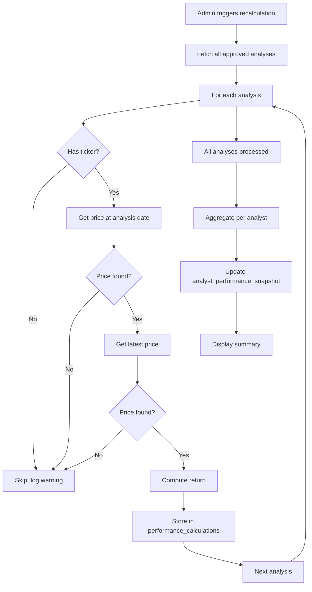

# Performance Calculation Logic

## Scope
- Calculate return for each approved analysis (`status = 'On Watchlist'`).
- Aggregate per‑analyst metrics.
- Support manual recalculation triggered by admin.

## Definitions

### Approved Analysis
- Analysis where `status = 'On Watchlist'` (or `is_approved = True`).
- Must have a valid company with a ticker symbol (i.e., tradable stock).
- Must have a valid `analysis_date`.

### Price at Analysis
- Closing stock price on the **analysis date**.
- If market was closed on that date, use the previous trading day's closing price.
- If price data is missing for that date (e.g., delisted before analysis date), treat as “data unavailable” and exclude from performance calculation.

### Current Price
- Most recent available closing price **up to today**.
- Typically the latest trading day before or on today.
- If the stock is delisted, use the last available price (delisting date).

### Return Calculation
- Simple return: `(current_price - price_at_analysis) / price_at_analysis * 100` (percentage).
- No adjustment for dividends, splits, etc. (simplified).
- If price_at_analysis is zero or missing, skip.

### Holding Period
- Not used for return calculation (we compute total return from analysis date to today).
- Could be extended to calculate annualized return later.

## Data Requirements

1. **Stock Prices**: Fetched and stored in `stock_prices` table.
2. **Analysis Data**: From `analyses` table with `company_id` and `analysis_date`.
3. **Company Ticker**: To map to price data.

## Calculation Steps

### 1. Identify analyses to calculate
```sql
SELECT a.id, a.company_id, a.analysis_date
FROM analyses a
JOIN companies c ON a.company_id = c.id
WHERE a.status = 'On Watchlist'
  AND c.ticker_symbol IS NOT NULL
  AND a.analysis_date IS NOT NULL;
```

### 2. For each analysis
- Get `price_at_analysis` = `get_price_on_date(company_id, analysis_date)`
- Get `price_current` = `get_latest_price(company_id)`
- If either price is missing, skip (log warning).
- Compute return.
- Upsert into `performance_calculations` table with `calculation_date = today`.

### 3. Aggregate per analyst
- Join `analysis_analysts` to get analysts per analysis.
- Compute analyst‑level metrics:
  - **Number of approved analyses** (count)
  - **Average return** (mean of returns across all their analyses)
  - **Median return** (optional)
  - **Win rate** (percentage of analyses with positive return)
  - **Total portfolio return** (equal‑weighted hypothetical portfolio: average of returns)
  - **Best / worst analysis** (max and min return)
- Store aggregated results in a cache table `analyst_performance_snapshot` (optional) or compute on‑the‑fly.

## Storage of Results

### Table `performance_calculations`
- `analysis_id`, `calculation_date`, `price_at_analysis`, `price_current`, `return_pct`, `calculated_at`
- Unique constraint on (`analysis_id`, `calculation_date`) to allow historical snapshots.

### Table `analyst_performance_snapshot` (optional)
- `analyst_id`, `calculation_date`, `num_analyses`, `avg_return`, `win_rate`, `total_return`, `best_return`, `worst_return`
- Updated each time calculation runs.

## Admin Trigger

- Button in admin panel “Recalculate Performance”.
- When clicked, start a background task (or synchronous if small).
- Show progress indicator (number of analyses processed).
- Upon completion, display summary and any errors.

## Error Handling

- Missing price data: log warning, skip analysis, but allow admin to see which analyses are missing data.
- Invalid date: skip.
- Network errors during price fetch: retry logic (max 3 times).

## Performance Considerations

- For large datasets, batch processing (e.g., 100 analyses at a time).
- Use caching of price lookups (e.g., dictionary of company‑date pairs).
- Consider using pandas for vectorized operations if heavy computation needed.

## UI Display

### Analyst Dashboard (for each analyst)
- Show personal metrics (average return, win rate, number of analyses).
- List of their approved analyses with returns (table).
- Optional chart of cumulative return over time.

### Admin Performance Dashboard
- Ranking table of all analysts sorted by average return.
- Filter by date range (e.g., analyses from last year).
- Export to CSV.

## Example Calculation

Assume analysis of company “Apple” (AAPL) on 2025‑01‑15.
- Price on 2025‑01‑15: $150.00
- Current price (2026‑01‑29): $200.00
- Return = (200 - 150) / 150 * 100 = 33.33%

If analyst has three analyses with returns +33%, -5%, +10%, their average return = (33 -5 +10)/3 = 12.67%, win rate = 2/3 = 66.7%.

## Mermaid Diagram: Calculation Flow



## Future Enhancements

- Annualized return calculation.
- Adjust for dividends and splits (using yfinance’s adjusted close).
- Benchmark comparison (e.g., vs S&P 500).
- Time‑weighted returns for portfolio simulation.