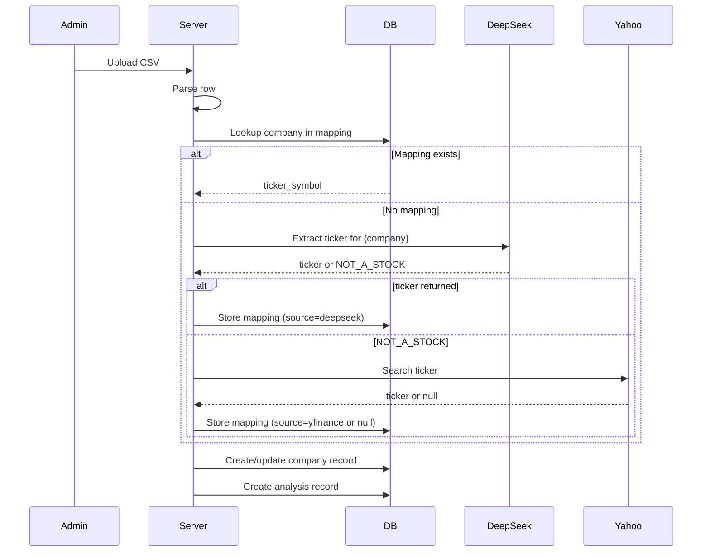

# Stock Data Integration

## Objectives
- Fetch historical and current stock prices for companies listed in analyses.
- Map company names to stock ticker symbols.
- Determine whether a CSV row represents a tradable stock (vs. event, workshop, etc.).
- Store price data locally to reduce API calls and enable performance calculations.

## Components

### 1. Ticker Symbol Resolution

#### Sources
- **Yahoo Finance Search**: Use `yfinance` library's `Ticker` or search functionality.
- **DeepSeek API**: Use natural language processing to extract ticker from company name and context (optional).
- **Manual Mapping Table**: Admin‑curated mapping of company name → ticker.

#### Workflow
1. When a new company is imported from CSV, attempt to resolve its ticker:
   - Check manual mapping table (DB table `company_ticker_maps`).
   - If not found, call DeepSeek API (if configured) with prompt: "What is the stock ticker for {company}? Respond only with the ticker symbol or 'NOT_A_STOCK' if it's not a publicly traded company."
   - If DeepSeek unavailable or returns `NOT_A_STOCK`, fall back to Yahoo Finance search.
   - If Yahoo Finance returns a match, store ticker.
   - If no match, mark ticker as `NULL` (non‑stock).
2. Cache results to avoid repeated API calls.

#### DeepSeek Integration
- Requires API key (configurable via admin panel).
- Use `requests` to call DeepSeek chat completions endpoint.
- Handle rate limiting and errors gracefully.
- Cost consideration: limit usage to new companies only.

### 2. Price Data Fetching

#### Yahoo Finance (`yfinance`)
- Use `yfinance.download(ticker, start=analysis_date, end=today)` to get daily close prices.
- For each company, store prices in `stock_prices` table (date, close_price).
- Ensure idempotent updates: insert or ignore duplicate (company_id, date).

#### Scheduling
- Admin‑triggered refresh (button in admin panel).
- Optionally, scheduled nightly job (cron) to fetch latest prices for all companies with approved analyses.

#### Error Handling
- Handle missing data (delisted stocks, incorrect ticker).
- Log errors and notify admin via UI.

### 3. Non‑Stock Detection

Some CSV rows represent events, workshops, learning sessions, or non‑public companies. These should be excluded from performance tracking.

**Heuristics:**
- Status column values: `Event`, `Workshop`, `Learning`, `NA`, `volno` → non‑stock.
- Company name contains words like "workshop", "evening", "collab", "strategie", "portfolio", "valuation".
- DeepSeek classification: Ask "Is {company} a publicly traded stock? Answer YES or NO."

**Implementation:**
- During CSV import, classify each row as `is_stock = True/False`.
- Store classification in analysis record (maybe via `ticker_symbol` nullability).
- Only rows with `is_stock = True` and `status = 'On Watchlist'` are considered for performance.

### 4. Data Storage Schema

#### Table `company_ticker_maps`
- `id` INTEGER PRIMARY KEY
- `company_name` TEXT UNIQUE
- `ticker_symbol` TEXT
- `source` TEXT ( 'manual', 'deepseek', 'yfinance' )
- `last_updated` TIMESTAMP

#### Table `stock_prices` (already defined)
- `company_id`, `date`, `close_price`, `volume`, `fetched_at`

### 5. Utility Modules

#### `yfinance_helper.py`
```python
import yfinance as yf
from datetime import date, timedelta

def fetch_prices(ticker: str, start_date: date, end_date: date) -> List[Dict]:
    """Download historical prices and return list of dicts."""
    pass

def search_ticker(company_name: str) -> Optional[str]:
    """Use yfinance search to find best‑matching ticker."""
    pass
```

#### `deepseek_client.py`
```python
import requests

class DeepSeekClient:
    def __init__(self, api_key: str):
        self.api_key = api_key
        self.base_url = "https://api.deepseek.com/v1/chat/completions"
    
    def extract_ticker(self, company_name: str) -> Optional[str]:
        """Ask DeepSeek for ticker symbol."""
        pass
    
    def classify_stock(self, company_name: str) -> bool:
        """Ask DeepSeek if this is a publicly traded stock."""
        pass
```

#### `price_manager.py`
```python
class PriceManager:
    def update_prices_for_company(self, company_id: int, force=False):
        """Ensure we have price data for all relevant dates."""
        pass
    
    def get_price_on_date(self, company_id: int, target_date: date) -> Optional[float]:
        """Return closing price on or before target_date."""
        pass
```

### 6. Admin Interface for Ticker Management

- Page listing all companies with their ticker status.
- Manual correction: edit ticker symbol, mark as non‑stock.
- Button "Lookup ticker via DeepSeek" for selected companies.
- Button "Fetch missing prices" to update price data.

### 7. Performance Implications

- Yahoo Finance rate limits: ~2000 requests per hour per IP, sufficient.
- DeepSeek API cost per request; cache results.
- SQLite can handle tens of thousands of price records; indexing crucial.

## Sequence Diagram: Ticker Resolution During CSV Import



## Next Steps

1. Implement `yfinance_helper` with error handling.
2. Implement DeepSeek client (optional).
3. Create price‑fetching background task.
4. Integrate with CSV import pipeline.
5. Build admin UI for ticker management.